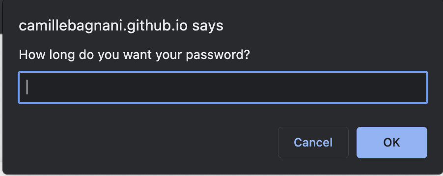

# Password Generator

## Description

This password generator was created to show the JavaScript skills I've learned so far. Its purpose is to generate a random password between 8-128 characters after answering a series of prompts including if you want lowercase letters, uppercase letters, numbers and/or special characters. This project taught me how to declare variables I would use throughout the code, comparison operators, if statements, for loops, the concat method, Math.floor and Math.random and more.

## Installation

To deploy the password, visit the project repository on GitHub > Settings > Pages > Source > Branch (main) > Save. From here you can view the finished project on GitHub Pages. You can view it via GitHub Pages here: https://camillebagnani.github.io/password-generator/

## Usage

This project is intended to be used as a password generator to give users a unique, random password of any length between 8-128 characters after following the prompts. You can copy and paste the password for your own use. Once you type the length of you password and it is between 8-128 charcters, click "Okay" and the rest of the prompts will follow.

## Credits

Starter code: https://github.com/coding-boot-camp/friendly-parakeet

## License

n/a